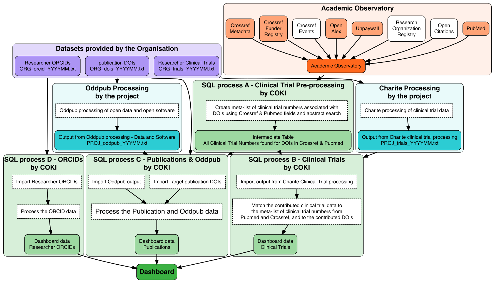

# Biomedical Open Science project - Dashboard Queries

*Open Science Dashboards for Biomedical Research Organisations*

### Contacts
coki@curtin.edu.au

*Rebecca Handcock, Kathryn Napier, Cameron Neylon*

### Description
Our objective is to create a digital tool that can automatically curate information, thus providing an audit, about Open Science research practices. Specifically, we have designed and implemented an automated dashboard that reports Open Science metrics. Our tool has been developed for and is specific to the discipline of biomedicine. The dashboard displays metrics and benchmarks to visualize institutional and individual performance regarding Open Science practices.

This repository contains version controlled SQL queries and processing scripts used to create data for these dashboards.

## How to generate data and update these dashboards
The dashboards for this project are created in Google LookerStudio, using data stored in BigQuery and processed with SQL scripts.
Additional scripts in 'R' are used to create flowcharts documenting project processes.

**Naming conventions for SQL scripts**

There are 4 SQL scripts stored as “Project Queries” within the BigQuery project that need to be run in sequence due to interdependencies between the datasets
Filenames contain a version number (eg 1o) which corresponds to a “sprint” of work, and a corresponding Jira ticket. Script filenames also contain a suffix of “YYYY_MMM_DD”, which is incremented whenever a new version of the script is made. At the end of the sprint, all intermediate copies will be deleted, leaving only the final copies of the scripts to represent the sprint.

**Steps to run these scripts and update data on the dashboards - this assumes that the raw data has already been uploaded into BigQuery.**

### Step 1 - Backup existing dashboard
If making a new dashboard version, export the dashboard as a PDF and upload to the GoogleDrive folder, and increment the LookerStudio dashboard version at the bottom of the FAQ page.

### Step 2A - Run SQL for PubMed data
This SQL script takes a data extract from the [Academic Observatory]([https://curtinic.atlassian.net/browse/COK-249](https://github.com/The-Academic-Observatory)) of Crossref and PubMed data and creates a combined list of Clinical Trials from these. The reason for creating this data extract is that the data is reused downstream in the workflow, so it makes sense to create it once and re-use it. This SQL script is listed as being required to be run first, but if the data already exists on disc then it does not need to be re-run. If the script does need to be run to make changes or for some other reason, then do the following steps:

1. In BigQuery, make a copy of the most recent SQL script and save it as a ‘Project’ query. Increment the naming to reflect the current sprint and creation date, eg `neuro_ver1o_query1_pubmed_2024_01_19`

2. Set variables at the top of the SQL script. These variables are not used to select data locations, but are 'text tags' that will be added as fields in the output file:
    - **var_SQL_script_name**: name of the SQL script, eg `neuro_ver1o_query1_pubmed_2024_01_19`
    - **var_SQL_year_cutoff**: earliest year that data is extracted from the Academic Observatory, eg 2000, or use 1 for all data
    - **var_AcademicObservatory_doi**: name of the DOI table version used, eg `doi20231217`
      
3. In the script, make sure that you are happy with the version of the BigQuery input dataset, as these may have been updated since the last time that the script was run:
    - **Academic Observatory** - the version of the Academic Observatory DOI table, eg `doi20231217`
   
5. Check that the output table has a similar naming convention to the script name, eg:
    - `clintrial_extract_ver1o_2024_01_19`
      
5. Make any other changes to the SQL script and save the changes.

6. Run the SQL script.

*Note: See information on the overloaded field containing both Clinical Trial Registries and Databanks [here](https://www.codecademy.com/pages/contribute-docs)*

### Step 2B - Run SQL for Trial data
This Trial Data query SQL script and should be run second due to dependencies between the files.

1. In BigQuery, make a copy of the most recent script and save it as a ‘Project’ query. Increment the naming to reflect the current sprint and creation date, eg `neuro_ver1o_query2_trials_2024_01_24a`
   
2. Set variables at the top of the SQL script. These variables are not used to select data locations, but are 'text tags' that will be added as fields in the output file:
    - **var_SQL_script_name**: name of the SQL script, eg `neuro_ver1o_query2_trials_2024_01_24a`
    - **var_data_trials**: Table name of clinical trials output from the Charite processing, eg `theneuro_trials_20231111`
    - **var_data_dois**: Table name containing DOIs from the partner institution, eg `theneuro_dois_20230217`

3. In the script, make sure that you are happy with the versions of the BigQuery input datasets, as these may have been updated since the last time that the script was run:
    - **Charite Processing by the Project** - `PROJ_trials_YYYYMM` Table of output from the Charite processing, eg `theneuro_trials_20231111`
    - **Publication DOIs** - `ORG_dois_YYYYMM` Table containing DOIs from the partner institution, eg `theneuro_dois_20230217`
    - **Clinical Trial data extract** - This table was created in Step 1, eg `clintrial_extract_ver1o_2024_01_19`

5. Check that the output table has a similar naming convention to the script name, eg:
    - `dashboard_data_ver1o_2024_01_24a_trials`

5. Make any other changes you want to make to the script and save the changes.

6. Run the script.

### Step 2C - Run SQL for Publication data
This is the main dashboard SQL query for The Neuro's publications and should be run third due to dependencies between the files.

1. In BigQuery, make a copy of the most recent script and save it as a ‘Project’ query. Increment the naming to reflect the current sprint and creation date, eg `neuro_ver1o_query3_pubs_2024_01_24b`
   
2. Set variables at the top of the SQL script. These variables are not used to select data locations, but are 'text tags' that will be added as fields in the output file:
    - **var_SQL_script_name**: name of the SQL script, eg  `neuro_ver1o_query3_pubs_2024_01_24b`
    - **var_data_dois**: Table name containing DOIs from the partner institution, eg `theneuro_dois_20230217`
    - **var_data_trials**: Table name of clinical trials output from the Charite processing, eg `theneuro_trials_20231111`
    - **var_data_oddpub**: name of the table of output from the Oddpub processing, eg `theneuro_oddpub_20231017`

3. In the script, make sure that you are happy with the versions of the BigQuery input datasets, as these may have been updated since the last time that the script was run:
    - **Publication DOIs** - `ORG_dois_YYYYMM` Table containing DOIs from the partner institution, `theneuro_dois_20230217`
    - **Researcher Clinical Trials** - `ORG_trials_YYYYMM` Table containing list of clinical trials from the partner institution, eg `dashboard_data_ver1o_2024_01_24a_trials`
    - **Oddpub Processing by the Project** - `PROJ_oddpub_YYYYMM` Table of output from the Oddpub processing, eg `theneuro_oddpub_20231017`
    - **Clinical Trial data extract** - This table was created in Step 1, eg `clintrial_extract_ver1o_2024_01_19`
    - **Academic Observatory** - the version of the Academic Observatory DOI table, eg `academic-observatory.observatory.doi20231217`

4. Check that the output table has a similar naming convention to the script name, eg:
    - `university-of-ottawa.neuro_dashboard_data_archive.dashboard_data_ver1o_2024_01_24b_pubs`

6. Make any other changes you want to make to the script and save the changes.
   
7. Run the script.

### Step 2D - Run SQL for ORCID data
The Researcher ORCID Data query SQL script and should be run fourth due to dependencies between the files.

1. In BigQuery, make a copy of the most recent script and save it as a ‘Project’ query. Increment the naming to reflect the current sprint and creation date, eg `neuro_ver1o_query4_orcid_2024_01_19`
   
2. Set variables at the top of the SQL script. These variables are not used to select data locations, but are 'text tags' that will be added as fields in the output file:
    - **var_SQL_script_name**: name of the SQL script, eg `neuro_ver1o_query4_orcid_2024_01_19`
    - **var_ORCID_Dataset_name**: name of the input datafile, eg `theneuro_orcids_20230906`
    - **var_output_table**: name of the output table, eg `dashboard_data_ver1o_2024_01_19_orcid`

3. In the script, make sure that you are happy with the versions of the BigQuery input datasets, as these may have been updated since the last time that the script was run:
      - The contributed Researcher ORCID data
    - **Researcher ORCIDs** - `ORG_orcid_YYYYMM` Table containing list of researcher ORCIDs from the partner institution, eg `dashboard_data_ver1o_2024_01_19_orcid`

4. Check that the output table has a similar naming convention to the script name, eg:
    - `university-of-ottawa.neuro_dashboard_data_archive.dashboard_data_ver1o_2024_01_19_orcid`
      
5. Make any other changes you want to make to the script and save the changes.

6. Run the script.

### Step 3 - Update the BigQuery views with the new data
Edit the following views to point at the tables created in Steps 2-4”. Do this by opening the view, going to the ‘Details’ tab, and clicking ‘Edit Query’. In the tab that opens, edit the query and select ‘Save View’. Back in the view, click ’Refresh’ at the top right.

    university-of-ottawa.neuro_dashboard_data.dashboard_data_trials
    university-of-ottawa.neuro_dashboard_data.dashboard_data_pubs
    university-of-ottawa.neuro_dashboard_data.dashboard_data_orcid

*Note: the *PubMed* data extract from Step 1 is not used in the dashboard

### Step 4 - Update the data connections in Looker Studio
In LookerStudio refresh the data connections to look at the new files:

    - Have the dashboard in edit mode and go to “Resource” > “Manage added data sources”
    - For each table, refresh the link by going “Edit” then “Edit Connection”
    - Check the correct view is still selected (it should not have changed) and click “Reconnect”
    - For “Apply connection changes” click “Yes”, then “Done”

### Step 5 - QC ...
Check all dashboard pages that everything looks OK. 

### Step 6 - Refresh the data extract in Google Sheets
Refresh the data extract for the Publications output that is made available the linked Google Sheet, “Data”, “Data Connectors”, “Refresh Options”, “Refresh All”. Copy/paste the main publication SQL into the dashboard page too.

### Step 7 - Back-up
Back-up the scripts to Github

---
### Internal project resources
[Jira ticket](https://curtinic.atlassian.net/browse/COK-249) and [GoogleDrive folder](https://drive.google.com/drive/folders/1I5uPFBWe0pQQT2myRHaCeAgU_xwAAVpg?usp=sharing)

